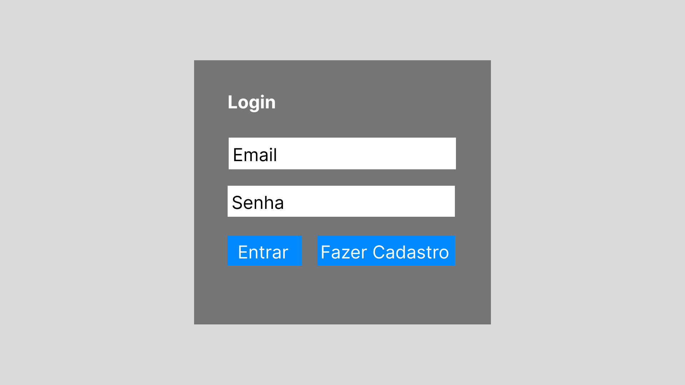
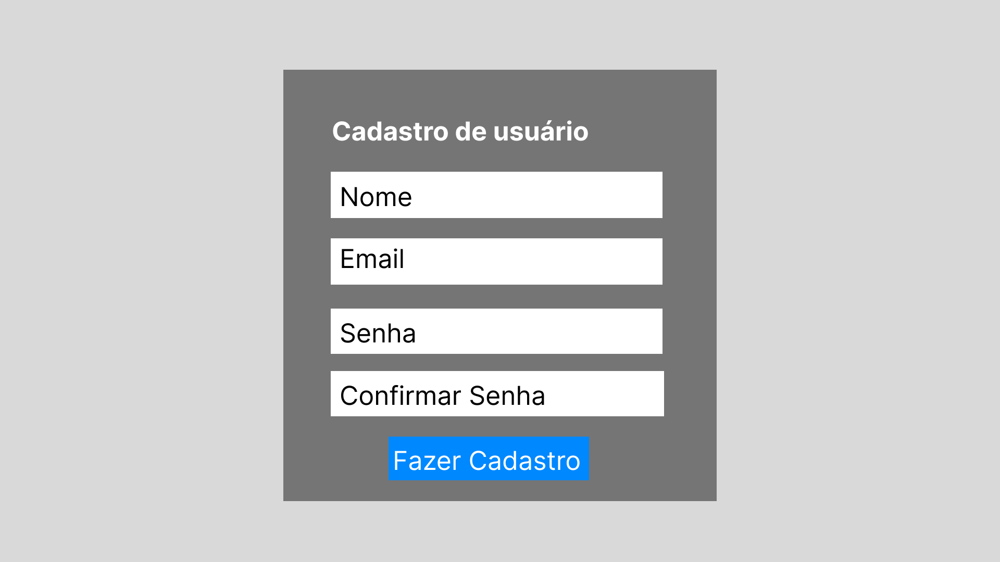
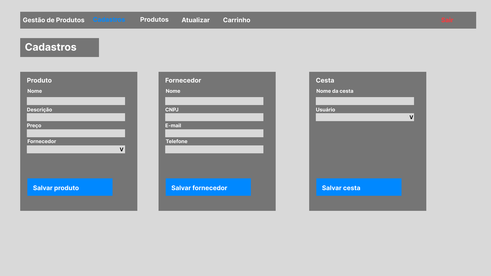
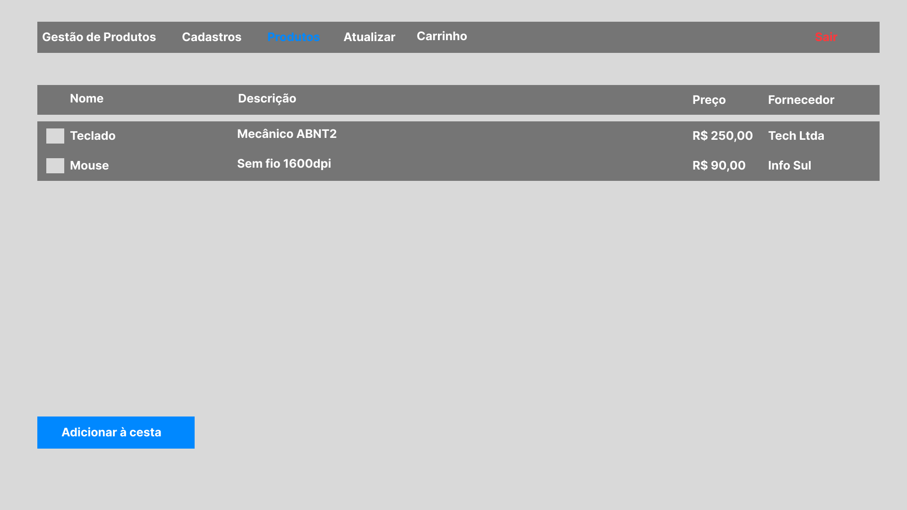
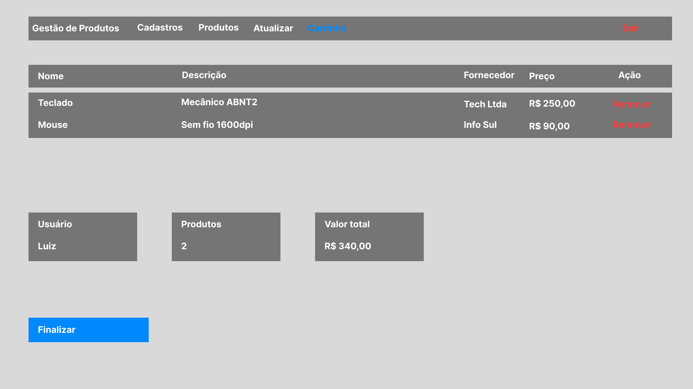
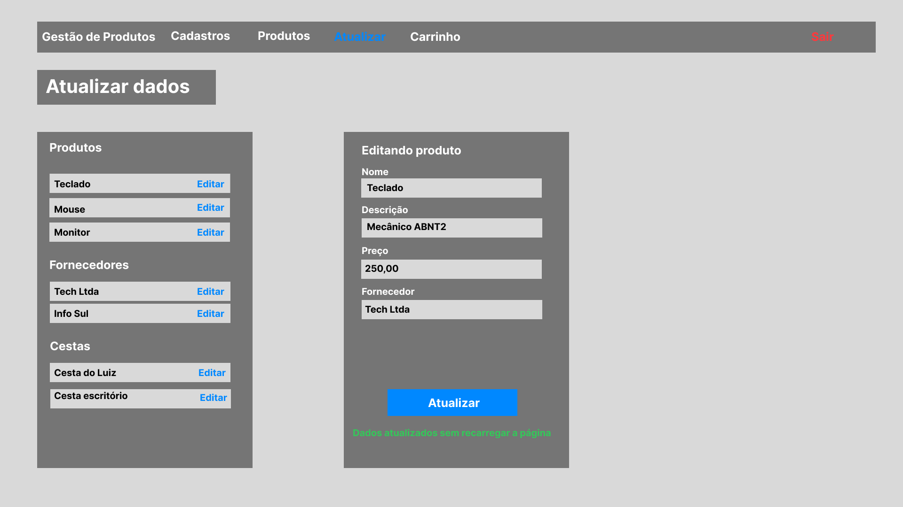
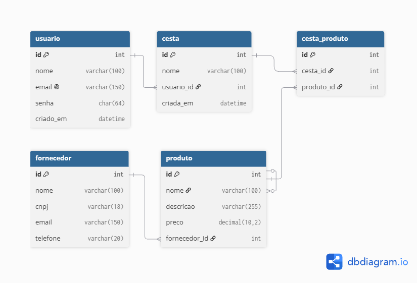

# Mini Sistema de Gestão de Produtos

Sistema web para cadastro de produtos, fornecedores e cestas de compra,
com autenticação de usuários. Desenvolvido para a disciplina de
Desenvolvimento Back-End.

## Integrantes

- Luiz Fernando Tresoldi Miguel, RA 60008139

## Tecnologias

PHP com PDO, MySQL, HTML, CSS, JavaScript e Bootstrap.

## Telas

Protótipo no Figma: https://www.figma.com/design/fp4LiiZBJAsogKmDKaA3w6/Mini-Sistema-de-Gest%C3%A3o-de-Produtos.?node-id=0-1&t=oeXHRHj1fY2r9vDa-1

## Modelagem

